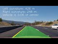

**Advanced Lane Finding Project**

The goals / steps of this project are the following:

* Compute the camera calibration matrix and distortion coefficients given a set of chessboard images.
* Apply a distortion correction to raw images.
* Use color transforms, gradients, etc., to create a thresholded binary image.
* Apply a perspective transform to rectify binary image ("birds-eye view").
* Detect lane pixels and fit to find the lane boundary.
* Determine the curvature of the lane and vehicle position with respect to center.
* Warp the detected lane boundaries back onto the original image.
* Output visual display of the lane boundaries and numerical estimation of lane curvature and vehicle position.

[//]: # (Image References)

[image1]: ./output_images/undistort.png "Undistorted"
[image2]: ./test_images/test1.jpg "Road Transformed"
[image3]: ./output_images/binary.png "Binary Example"
[image4]: ./output_images/warped.png "Warp Example"
[image5]: ./output_images/fit_lines.png "Fit Visual"
[image6]: ./output_images/output.png "Output"
[video1]: ./test_video.mp4 "Video"

### Camera Calibration

#### 1. Briefly state how you computed the camera matrix and distortion coefficients. Provide an example of a distortion corrected calibration image.

The code for this step is contained in Cell # 3-5 in `P4.ipynb`

I start by preparing "object points", which will be the (x, y, z) coordinates of the chessboard corners in the world. Here I am assuming the chessboard is fixed on the (x, y) plane at z=0, such that the object points are the same for each calibration image.  Thus, `objp` is just a replicated array of coordinates, and `objpoints` will be appended with a copy of it every time I successfully detect all chessboard corners in a test image.  `imgpoints` will be appended with the (x, y) pixel position of each of the corners in the image plane with each successful chessboard detection.  

I then used the output `objpoints` and `imgpoints` to compute the camera calibration and distortion coefficients using the `cv2.calibrateCamera()` function.  I applied this distortion correction to the test image using the `cv2.undistort()` function and obtained this result: 

![alt text][image1]

### Pipeline (single images)

#### 1. Provide an example of a distortion-corrected image.

To demonstrate this step, I will describe how I apply the distortion correction to one of the test images like this one:
![alt text][image2]

#### 2. Describe how (and identify where in your code) you used color transforms, gradients or other methods to create a thresholded binary image.  Provide an example of a binary image result.

I used a combination of color and gradient thresholds to generate a binary image (thresholding steps at Cell # 11 in `P4.ipynb`). Following are the thresholding values: Sobel Threshold:(20, 100), HLS color Channel, S Threshold: (145, 200), L Threshold: (145, 200).  Here's an example of my output for this step with distortion corrected binary image. 

![alt text][image3]

#### 3. Describe how (and identify where in your code) you performed a perspective transform and provide an example of a transformed image.

The code for my perspective transform includes a function called `warper()`, appears in Cell # 14 of `P4.ipynb`.  The `warper()` function takes as inputs an image (`img`), as well as source (`src`) and destination (`dst`) points.  I chose to hardcode the source and destination points:

| Source        | Destination   | 
|:-------------:|:-------------:| 
| 585, 455      | 200, 0        | 
| 2190 720      | 200, 680      |
| 1130, 720     | 1000, 0       |
| 705, 455      | 1000, 680     |

I verified that my perspective transform was working as expected by drawing the `src` and `dst` points onto a test image and its warped counterpart to verify that the lines appear parallel in the warped image.

![alt text][image4]

#### 4. Describe how (and identify where in your code) you identified lane-line pixels and fit their positions with a polynomial?

See Cell # 17 in `P4.ipynb`

To identify lane-lines need to decide explicitly which pixels are part of the lines and which belong to the left line and which belong to the right line. First take a histogram along all the columns in the lower half of the image. With this histogram, add up the pixel values along each column in the image. The two most prominent peaks in this histogram will be good indicators of the x-position of the base of the lane lines. This is used as a starting point for where to search for the lines. Then use a sliding window, placed around the line centers, to find and follow the lines up to the top of the frame and then fit a second order polynomial to find left and right predicted lines. 

Below is a text image showing the identified lane-lines:

![alt text][image5]

#### 5. Describe how (and identify where in your code) you calculated the radius of curvature of the lane and the position of the vehicle with respect to center.

See Cell # 20. The method relies on the first and second order derivative of the polynominal function used to detect lane line pixes and defines the curve radius as follows:

R = (1/|2A|) * (1 + (2Ay + B)^2)^3/2

Assuming that the center of the image gives the position of the camera, consequently of the car, in python for an image, camera_position = image.shape[1]/2. The center of the lane is the difference between the predicted lane
lines at a position closest to the car. Assuming the height of the image is 720 pixels and that the lane predictions are stored in right_x_predictions and left_x_predictions, then the center of the
lane would be: lane_center = (right_x_predictions[719] + left_x_predictions[719])/2. Therefore offset of the car from the lane's center would be: center_offset_pixels = abs(camera_position - lane_center)

#### 6. Provide an example image of your result plotted back down onto the road such that the lane area is identified clearly.

See Cell # 22, 23.  Here is an example of the result on a test image radius of curvature of the lane and the position of the vehicle with respect to center printed:

![alt text][image6]

---

### Pipeline (video)

#### 1. Provide a link to your final video output.  Your pipeline should perform reasonably well on the entire project video (wobbly lines are ok but no catastrophic failures that would cause the car to drive off the road!).

Below is the youtube linked test video:

---

### Discussion

#### 1. Briefly discuss any problems / issues you faced in your implementation of this project.  Where will your pipeline likely fail?  What could you do to make it more robust?

The pipeline works well for the first test video, however fails for the other two challange videos. I need to play with the threshold parameters such as color and gradient thresholding to imporve lane line detection. Also histogram normalization may also help. Also need to investigate ways to make the algorithm more robust, in terms of reliant on manual thresholding. 

